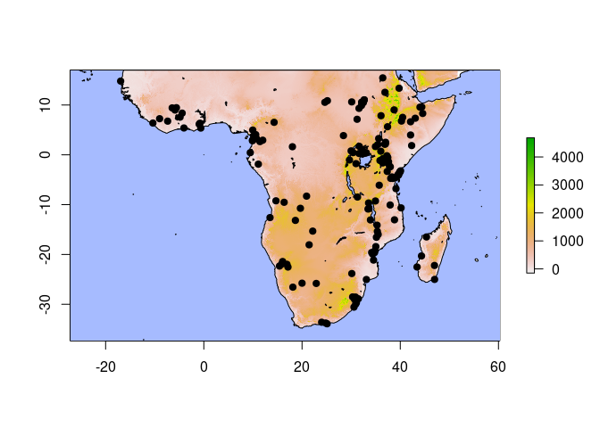
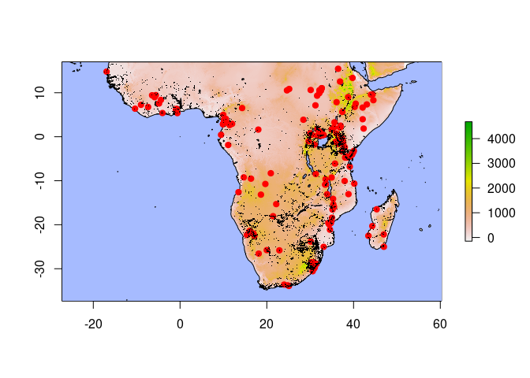
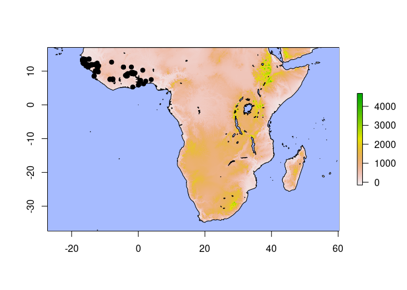
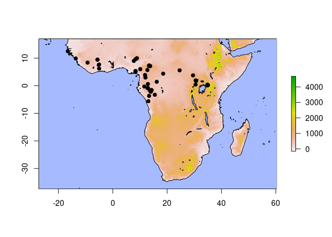
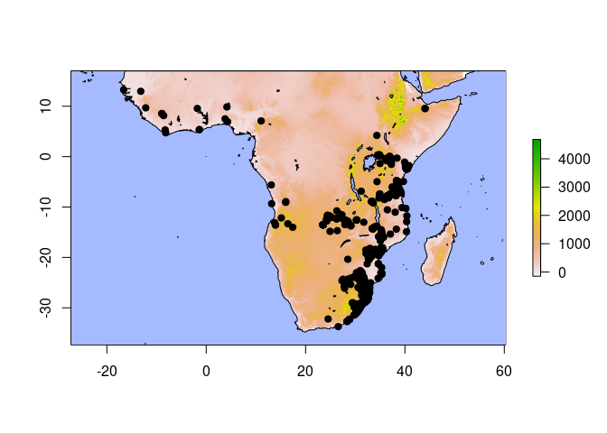
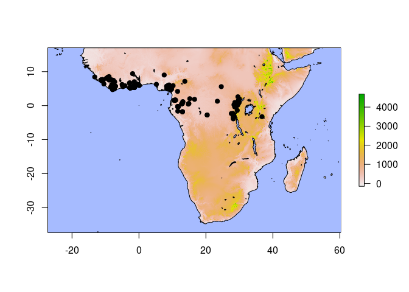

Dicrurus Colorspace
================

Occurrences come from a georeferenced specimen database and from the
Global Biodiversity Informatics Facility, specifically: GBIF.org (10
March 2022) GBIF Occurrence Download
<https://doi.org/10.15468/dl.b5q394>

``` r
library(data.table)
library(factoextra)
```

    ## Loading required package: ggplot2

    ## Welcome! Want to learn more? See two factoextra-related books at https://goo.gl/ve3WBa

``` r
library(maptools)
```

    ## Loading required package: sp

    ## Checking rgeos availability: TRUE

``` r
library(MASS)
library(raster)
```

    ## 
    ## Attaching package: 'raster'

    ## The following object is masked from 'package:MASS':
    ## 
    ##     select

``` r
library(rnaturalearth)
library(rnaturalearthhires)
library(rgdal)
```

    ## Please note that rgdal will be retired by the end of 2023,
    ## plan transition to sf/stars/terra functions using GDAL and PROJ
    ## at your earliest convenience.
    ## 
    ## rgdal: version: 1.5-28, (SVN revision 1158)
    ## Geospatial Data Abstraction Library extensions to R successfully loaded
    ## Loaded GDAL runtime: GDAL 3.0.4, released 2020/01/28
    ## Path to GDAL shared files: /usr/share/gdal
    ## GDAL binary built with GEOS: TRUE 
    ## Loaded PROJ runtime: Rel. 6.3.1, February 10th, 2020, [PJ_VERSION: 631]
    ## Path to PROJ shared files: /usr/share/proj
    ## Linking to sp version:1.4-6
    ## To mute warnings of possible GDAL/OSR exportToProj4() degradation,
    ## use options("rgdal_show_exportToProj4_warnings"="none") before loading sp or rgdal.

``` r
library(sf)
```

    ## Linking to GEOS 3.8.0, GDAL 3.0.4, PROJ 6.3.1

``` r
library(tidyverse)
```

    ## ── Attaching packages ─────────────────────────────────────── tidyverse 1.3.1 ──

    ## ✓ tibble  3.1.6     ✓ dplyr   1.0.8
    ## ✓ tidyr   1.2.0     ✓ stringr 1.4.0
    ## ✓ readr   2.1.2     ✓ forcats 0.5.1
    ## ✓ purrr   0.3.4

    ## ── Conflicts ────────────────────────────────────────── tidyverse_conflicts() ──
    ## x dplyr::between()   masks data.table::between()
    ## x tidyr::extract()   masks raster::extract()
    ## x dplyr::filter()    masks stats::filter()
    ## x dplyr::first()     masks data.table::first()
    ## x dplyr::lag()       masks stats::lag()
    ## x dplyr::last()      masks data.table::last()
    ## x dplyr::select()    masks raster::select(), MASS::select()
    ## x purrr::transpose() masks data.table::transpose()

``` r
library(vegan)
```

    ## Loading required package: permute

    ## Loading required package: lattice

    ## This is vegan 2.5-7

# Specimen Localities

Import coordinates for colorspace specimens from KMZ file.

``` r
# converted from KMZ in QGIS

ocean=readOGR(paste0(gis,"ne_10m_ocean/ne_10m_ocean.shp"))
```

    ## OGR data source with driver: ESRI Shapefile 
    ## Source: "/home/j141c380/Dropbox/GIS/ne_10m_ocean/ne_10m_ocean.shp", layer: "ne_10m_ocean"
    ## with 1 features
    ## It has 3 fields

``` r
lakes=readOGR(paste0(gis,"ne_10m_lakes/ne_10m_lakes.shp"))
```

    ## OGR data source with driver: ESRI Shapefile 
    ## Source: "/home/j141c380/Dropbox/GIS/ne_10m_lakes/ne_10m_lakes.shp", layer: "ne_10m_lakes"
    ## with 1354 features
    ## It has 37 fields
    ## Integer64 fields read as strings:  scalerank ne_id

``` r
elev=raster(paste0(gis,"elevation_1KMmd_GMTEDmd.tif"))
specimen.xy=readOGR(paste0(filepath,"dicrurus.gpkg"))
```

    ## OGR data source with driver: GPKG 
    ## Source: "/home/j141c380/Dropbox/Manuscripts/Dicrurus/dicrurus.gpkg", layer: "dicrurus"
    ## with 147 features
    ## It has 11 fields

``` r
xlim=c(extent(specimen.xy)[1:2])
ylim=c(extent(specimen.xy)[3:4])
```

``` r
plot(elev,xlim=xlim*1.1,ylim=ylim*1.1)
plot(ocean,col="#A6BBFF",add=T)
plot(lakes,col="#A6BBFF",add=T)
points(specimen.xy,col="black",pch=19)
```

<!-- -->

Link the occurrences with specimen metadata. This has to be done based
on placenames.

``` r
specimen.data=specimen.xy@data
specimen.data=cbind(specimen.xy@coords,specimen.data)
colnames(specimen.data)[1]="Long"
colnames(specimen.data)[2]="Lat"
specimen.data=specimen.data%>%
  dplyr::select(Long,Lat,Name)

for(i in 1:nrow(specimen.data)){
  loc=specimen.data$Name[i]
  specimen.data$Name[i]=strsplit(loc,") ")[[1]][2]
}

write_csv(specimen.data,paste0(filepath,"localities.csv"))
```

I checked names externally to be sure they matched up. There are a lot
of localities missing from the KMZ - so I’ve kicked it back to the
others for verification of localities.

``` r
utms=read_csv(paste0(filepath,'dicrurus_utm.csv'))
```

    ## Rows: 255 Columns: 22
    ## ── Column specification ────────────────────────────────────────────────────────
    ## Delimiter: ","
    ## chr  (9): Museum, quality check, Locality, Country, Sex/popn, sex, species, ...
    ## dbl (13): Mus_cat#, UTM E, UTM N, Kipps (mm), Wing length (mm), Tail retrice...
    ## 
    ## ℹ Use `spec()` to retrieve the full column specification for this data.
    ## ℹ Specify the column types or set `show_col_types = FALSE` to quiet this message.

``` r
utms$Lat=utms$Long=0
```

## Merge with GBIF

We are going to merge the above with GBIF data.

``` r
# read GBIF
gbif=read.delim(paste0(filepath,"dicrurus_gbif.csv"),
             sep="\t") # specify tab separation

# remove extraneous columns
# parse to relevant columns
gbif=gbif%>%
  # remove gridded data as determined in QGIS
  filter(institutionCode!='6992',
         institutionCode!='6993',
         institutionCode!='APLORI',
         institutionCode!='FIAO')%>%
  dplyr::select(genus,species,infraspecificEpithet,
         scientificName,individualCount,
         decimalLongitude,decimalLatitude,coordinateUncertaintyInMeters,
         coordinatePrecision,
         day,month,year,countryCode)

# write reduced file
write_csv(gbif,file=paste0(filepath,"reduced_gbif.csv"))

# remove NA vals from uncertatainty
# assume accurate unless states otherwise
gbif[is.na(gbif$coordinateUncertaintyInMeters),
  "coordinateUncertaintyInMeters"]=0

# localities only
gbif=gbif%>%
  # remove uncertainty over 10km
  filter(coordinateUncertaintyInMeters<=10000)%>%
  select(species,infraspecificEpithet,
         decimalLongitude,decimalLatitude,
         countryCode,month)%>%
  # get unique
  unique()

write_csv(gbif,file = paste0(filepath,"dicrurus_gbif_localities.csv"))
```

``` r
gbif=read_csv(paste0(filepath,"dicrurus_gbif_localities.csv"))
```

    ## Rows: 18129 Columns: 6
    ## ── Column specification ────────────────────────────────────────────────────────
    ## Delimiter: ","
    ## chr (3): species, infraspecificEpithet, countryCode
    ## dbl (3): decimalLongitude, decimalLatitude, month
    ## 
    ## ℹ Use `spec()` to retrieve the full column specification for this data.
    ## ℹ Specify the column types or set `show_col_types = FALSE` to quiet this message.

``` r
plot(elev,xlim=xlim*1.1,ylim=ylim*1.1)
plot(ocean,col="#A6BBFF",add=T)
plot(lakes,col="#A6BBFF",add=T)
points(specimen.xy,col="red",pch=19)
points(gbif$decimalLongitude,gbif$decimalLatitude,
       col="black",pch=".")
```

<!-- -->

The samples specimens cover a lot more of northeastern Africa than the
other data. Note how data-dense Southern Africa is relative to the rest
of the continent!

Prepare data for merge.

``` r
# create voucher column

colnames(gbif)=c("SciName","Subspecies","Long","Lat","Country","Month")

# only gbif data for now; to be changed later

gbif=gbif%>%
  dplyr::select(SciName,Subspecies,Long,Lat)

write_csv(gbif,paste0(filepath,"combined_data.csv"))
```

# Population assignation

Ensure that populations are correctly assigned. This is where things get
tricky! Note that specimens are likely correctly attributed.

``` r
data=read_csv(paste0(filepath,"combined_data.csv"))
```

    ## Rows: 18129 Columns: 4
    ## ── Column specification ────────────────────────────────────────────────────────
    ## Delimiter: ","
    ## chr (2): SciName, Subspecies
    ## dbl (2): Long, Lat
    ## 
    ## ℹ Use `spec()` to retrieve the full column specification for this data.
    ## ℹ Specify the column types or set `show_col_types = FALSE` to quiet this message.

``` r
data$SciName=as.factor(data$SciName)
data$Subspecies=as.factor(data$Subspecies)
summary(data)
```

    ##                 SciName            Subspecies         Long       
    ##  Dicrurus adsimilis :15243   adsimilis  :  629   Min.   :-17.43  
    ##  Dicrurus ludwigii  : 1017   divaricatus:  180   1st Qu.: 22.60  
    ##  Dicrurus forficatus:  854   apivorus   :  138   Median : 30.59  
    ##  Dicrurus atactus   :  320   fugax      :  113   Mean   : 26.29  
    ##  Dicrurus modestus  :  259   forficatus :   63   3rd Qu.: 35.30  
    ##  (Other)            :  428   (Other)    :  132   Max.   : 50.10  
    ##  NA's               :    8   NA's       :16874                   
    ##       Lat        
    ##  Min.   :-34.83  
    ##  1st Qu.:-25.16  
    ##  Median :-17.92  
    ##  Mean   :-13.50  
    ##  3rd Qu.: -1.57  
    ##  Max.   : 16.53  
    ## 

``` r
unique(data$SciName)
```

    ##  [1] Dicrurus adsimilis    Dicrurus modestus     Dicrurus atripennis  
    ##  [4] Dicrurus ludwigii     Dicrurus forficatus   Dicrurus waldenii    
    ##  [7] Dicrurus sharpei      Dicrurus occidentalis Dicrurus atactus     
    ## [10] Dicrurus hottentottus <NA>                  Dicrurus fuscipennis 
    ## [13] Dicrurus megarhynchus Dicrurus elgonensis  
    ## 13 Levels: Dicrurus adsimilis Dicrurus atactus ... Dicrurus waldenii

Looks like all twelve species are here. We need to make sure we have all
species ascribed correctly.

``` r
species.plotter=function(sciname,data){
  data2=data%>%
    filter(SciName==sciname)%>%
    dplyr::select(Long,Lat)
  
  plot(elev,xlim=xlim*1.1,ylim=ylim*1.1)
  plot(ocean,col="#A6BBFF",add=T)
  plot(lakes,col="#A6BBFF",add=T)
  points(data2,col="black",pch=19)
}
```

## *Dicrurus occidentalis*

``` r
which(data$Subspecies%like%"occidentalis")
```

    ## integer(0)

There is nothing ascribed to the subspecies *occidentalis*.

``` r
species.plotter(data=data,sciname="Dicrurus occidentalis")
```

<!-- -->

All individuals are within the range of *D. occidentalis*.

## *Dicrurus sharpei*

``` r
data[which(data$Subspecies%like%"sharpei"),]
```

    ## # A tibble: 19 × 4
    ##    SciName           Subspecies   Long    Lat
    ##    <fct>             <fct>       <dbl>  <dbl>
    ##  1 Dicrurus ludwigii sharpei     13.3  -3.68 
    ##  2 Dicrurus ludwigii sharpei    -13.6   9.89 
    ##  3 Dicrurus ludwigii sharpei     12.7  -0.812
    ##  4 Dicrurus ludwigii sharpei     -5.03  7.69 
    ##  5 Dicrurus ludwigii sharpei     -5.03  6.22 
    ##  6 Dicrurus ludwigii sharpei     -9.29  8.38 
    ##  7 Dicrurus ludwigii sharpei    -16.5  12.5  
    ##  8 Dicrurus ludwigii sharpei     13.6  -1.63 
    ##  9 Dicrurus ludwigii sharpei     18.6   4.36 
    ## 10 Dicrurus ludwigii sharpei     34.9   0.27 
    ## 11 Dicrurus ludwigii sharpei     12.0   2.97 
    ## 12 Dicrurus ludwigii sharpei     34.9   0.27 
    ## 13 Dicrurus ludwigii sharpei     34.9   0.27 
    ## 14 Dicrurus ludwigii sharpei     -5.63  9.45 
    ## 15 Dicrurus ludwigii sharpei     24.6   5.58 
    ## 16 Dicrurus ludwigii sharpei     -5.63  9.45 
    ## 17 Dicrurus ludwigii sharpei     30.7   1.75 
    ## 18 Dicrurus ludwigii sharpei     30.5   1.92 
    ## 19 Dicrurus ludwigii sharpei      8.40  9.61

There are several misclassified *D. ludwigii* still.

``` r
index=which(data$Subspecies%like%"sharpei")

data[index,"SciName"]="Dicrurus sharpei"
data[index,"Subspecies"]=NA
```

``` r
species.plotter(data=data,sciname="Dicrurus sharpei")
```

<!-- -->

There are lots of erroneous western records, which refer to *D.
occidentalis*.

``` r
data[which(data$SciName%like%"sharpei"&data$Long<3.45),
     "SciName"]="Dicrurus occidentalis"
```

## *Dicrurus ludwigii*

This species consists of the following subspecies:

1.  *saturnus* from Angola to Katanga and Zambia
2.  *muenzneri* from Somalia, Kenya, and Tanzania (coastal?)
3.  *tephrogaster* from Malawi, Zimbabwi, and Mozambique “north of
    Limpopo River”
4.  *ludwigii* for all localities S of Limpopo R

``` r
unique(data$Subspecies[data$SciName%like%"ludwigii"])
```

    ## [1] <NA>         ludwigii     muenzneri    tephrogaster
    ## 15 Levels: adsimilis apivorus atactus coracinus divaricatus ... ugandensis

All subspecies appear to be part of the species complex. Strangely, no
*saturnus* are labeled in the group.

``` r
species.plotter(data=data,sciname = "Dicrurus ludwigii")
```

<!-- -->

*Note* that populations in W Africa are labeled incorrectly. Using the
above threshold:

``` r
data[which(data$SciName%like%"ludwigii"&data$Long<3.45),
     "SciName"]="Dicrurus occidentalis"
data[which(data$SciName%like%"ludwigii"&
             data$Long<20&data$Lat>0),
     "SciName"]="Dicrurus sharpei"
```

## *Dicrurus atripennis*

``` r
unique(data$Subspecies[data$SciName%like%"atripennis"])
```

    ## [1] <NA>
    ## 15 Levels: adsimilis apivorus atactus coracinus divaricatus ... ugandensis

No subspecies, as expected.

``` r
species.plotter(sciname = "Dicrurus atripennis",data=data)
```

<!-- --> There
are some northerly, almost sehelian records that are surprising. The
only one that we can immediately say is in error is the Kenyan record.

``` r
data=data[-which(data$SciName%like%"atripennis"&
             data$Long>32.5),]
```

## *Dicrurus adsimilis*

``` r
summary(data$Subspecies[data$SciName%like%"adsimilis"])
```

    ##    adsimilis     apivorus      atactus    coracinus  divaricatus   forficatus 
    ##          629          138            0            0          180            0 
    ##        fugax hottentottus     ludwigii     lugubris    muenzneri       potior 
    ##          113            0            0            9            0            0 
    ##      sharpei tephrogaster   ugandensis         NA's 
    ##            0            0            0        14174

Most of these are NA; we need to correct them to subspecies.

## *Dicrurus divaricatus*

## *Dicrurus atactus*

## *Dicrurus modestus*

## *Dicrurus aldabranus*

## *Dicrurus fuscipennis*

## *Dicrurus forficatus*

## *Dicrurus waldenii*

# Extract Environmental Data

``` r
env_layers=paste0(gis,"ENVIREM_30arcsec/",
  list.files(paste0(gis,"ENVIREM_30arcsec/"),pattern="*.bil"))

# remove set count files
```
