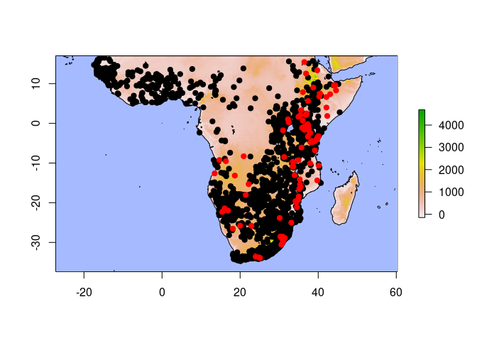

Dicrurus Colorspace
================

Occurrences come from a georeferenced specimen database and from the
Global Biodiversity Informatics Facility, specifically: GBIF.org (10
March 2022) GBIF Occurrence Download
<https://doi.org/10.15468/dl.b5q394>

``` r
library(data.table)
library(factoextra)
```

    ## Loading required package: ggplot2

    ## Welcome! Want to learn more? See two factoextra-related books at https://goo.gl/ve3WBa

``` r
library(fossil) # Rarefy code
```

    ## Loading required package: sp

    ## Loading required package: maps

    ## Loading required package: shapefiles

    ## Loading required package: foreign

    ## 
    ## Attaching package: 'shapefiles'

    ## The following objects are masked from 'package:foreign':
    ## 
    ##     read.dbf, write.dbf

``` r
library(maptools)
```

    ## Checking rgeos availability: TRUE
    ## Please note that 'maptools' will be retired by the end of 2023,
    ## plan transition at your earliest convenience;
    ## some functionality will be moved to 'sp'.

``` r
library(MASS)
library(raster)
```

    ## 
    ## Attaching package: 'raster'

    ## The following objects are masked from 'package:MASS':
    ## 
    ##     area, select

    ## The following object is masked from 'package:data.table':
    ## 
    ##     shift

``` r
library(rnaturalearth)
library(rnaturalearthhires)
library(rgdal)
```

    ## Please note that rgdal will be retired by the end of 2023,
    ## plan transition to sf/stars/terra functions using GDAL and PROJ
    ## at your earliest convenience.
    ## 
    ## rgdal: version: 1.5-28, (SVN revision 1158)
    ## Geospatial Data Abstraction Library extensions to R successfully loaded
    ## Loaded GDAL runtime: GDAL 3.3.2, released 2021/09/01
    ## Path to GDAL shared files: /usr/share/gdal
    ## GDAL binary built with GEOS: TRUE 
    ## Loaded PROJ runtime: Rel. 7.2.1, January 1st, 2021, [PJ_VERSION: 721]
    ## Path to PROJ shared files: /home/kupeornis/.local/share/proj:/usr/share/proj
    ## PROJ CDN enabled: FALSE
    ## Linking to sp version:1.4-6
    ## To mute warnings of possible GDAL/OSR exportToProj4() degradation,
    ## use options("rgdal_show_exportToProj4_warnings"="none") before loading sp or rgdal.

``` r
library(sf)
```

    ## Linking to GEOS 3.9.1, GDAL 3.3.2, PROJ 7.2.1; sf_use_s2() is TRUE

``` r
library(tidyverse)
```

    ## ── Attaching packages ─────────────────────────────────────── tidyverse 1.3.1 ──

    ## ✓ tibble  3.1.4     ✓ dplyr   1.0.7
    ## ✓ tidyr   1.2.0     ✓ stringr 1.4.0
    ## ✓ readr   2.1.2     ✓ forcats 0.5.1
    ## ✓ purrr   0.3.4

    ## ── Conflicts ────────────────────────────────────────── tidyverse_conflicts() ──
    ## x dplyr::between()   masks data.table::between()
    ## x tidyr::extract()   masks raster::extract()
    ## x dplyr::filter()    masks stats::filter()
    ## x dplyr::first()     masks data.table::first()
    ## x dplyr::lag()       masks stats::lag()
    ## x dplyr::last()      masks data.table::last()
    ## x purrr::map()       masks maps::map()
    ## x dplyr::select()    masks raster::select(), MASS::select()
    ## x purrr::transpose() masks data.table::transpose()

``` r
library(vegan)
```

    ## Loading required package: permute

    ## Loading required package: lattice

    ## This is vegan 2.5-7

# Specimen Localities

Import coordinates for colorspace specimens from KMZ file.

``` r
# converted from KMZ in QGIS

ocean=readOGR(paste0(gis,"ne_10m_ocean/ne_10m_ocean.shp"))
```

    ## OGR data source with driver: ESRI Shapefile 
    ## Source: "/home/kupeornis/Dropbox/GIS/ne_10m_ocean/ne_10m_ocean.shp", layer: "ne_10m_ocean"
    ## with 1 features
    ## It has 3 fields

``` r
lakes=readOGR(paste0(gis,"ne_10m_lakes/ne_10m_lakes.shp"))
```

    ## OGR data source with driver: ESRI Shapefile 
    ## Source: "/home/kupeornis/Dropbox/GIS/ne_10m_lakes/ne_10m_lakes.shp", layer: "ne_10m_lakes"
    ## with 1354 features
    ## It has 37 fields
    ## Integer64 fields read as strings:  scalerank ne_id

``` r
elev=raster(paste0(gis,"elevation_1KMmd_GMTEDmd.tif"))
specimen.xy=read_csv(paste0(filepath,'dicrurus_locs_mar2022.csv'))
```

    ## Rows: 255 Columns: 22
    ## ── Column specification ────────────────────────────────────────────────────────
    ## Delimiter: ","
    ## chr  (9): Museum, check, Notes, Sex/popn, sex, species, fugax country, fugax...
    ## dbl (13): Catalog, Long, Lat, Kipps (mm), Wing length (mm), Tail retrice T5 ...
    ## 
    ## ℹ Use `spec()` to retrieve the full column specification for this data.
    ## ℹ Specify the column types or set `show_col_types = FALSE` to quiet this message.

``` r
# NOTE that long and lat were switched during the conversion
ylim=c(min(specimen.xy$Long),max(specimen.xy$Long))
xlim=c(min(specimen.xy$Lat),max(specimen.xy$Lat))
```

Correct the species field.

``` r
unique(specimen.xy$species)
```

    ##  [1] "ads.fugax"                  "apivorus"                  
    ##  [3] "ads.jubaensis"              "divar(east)/ads.jubaensis?"
    ##  [5] "ads.jubaensis/ads.fugax?"   "mod.coracinus"             
    ##  [7] "divar(east)/divar(west)?"   "divar(west)"               
    ##  [9] "atactus"                    "ads.adsimilis/ads.fugax?"  
    ## [11] "ads.adsimilis"              "divar(east)"               
    ## [13] "ads.fugax(usambara)"        "forficatus"

``` r
# ORDER MATTERS! Most complex first.
specimen.xy$species=gsub("divar(east)/ads.jubaensis?","Dicrurus divaricatus/adsimilis jubaensis",specimen.xy$species)
specimen.xy$species=gsub("ads.jubaensis/ads.fugax?","Dicrurus adsimilis jubaensis/fugax",specimen.xy$species)
specimen.xy$species=gsub("divar(east)/divar(west)?","Dicrurus divaricatus east/west",specimen.xy$species)
specimen.xy$species=gsub("ads.adsimilis/ads.fugax?","Dicrurus adsimilis adsimilis/fugax",specimen.xy$species)
specimen.xy$species=gsub("ads.fugax","Dicrurus adsimilis fugax",specimen.xy$species)
specimen.xy$species=gsub("apivorus","Dicrurus aapivorus",specimen.xy$species)
specimen.xy$species=gsub("ads.jubaensis","Dicrurus adsimilis jubaensis",specimen.xy$species)
specimen.xy$species=gsub("mod.coracinus","Dicrurus modestus coracinus",specimen.xy$species)
specimen.xy$species=gsub("divar(west)","Dicrurus divaricatus west",specimen.xy$species)
specimen.xy$species=gsub("atactus","Dicrurus atactus",specimen.xy$species)
specimen.xy$species=gsub("ads.adsimilis","Dicrurus adsimilis adsimilis",specimen.xy$species)
specimen.xy$species=gsub("divar(east)","Dicrurus divaricatus east",specimen.xy$species)
specimen.xy$species=gsub("ads.fugax(usambara)","Dicrurus adsimilis fugax",specimen.xy$species)
specimen.xy$species=gsub("forficatus","Dicrurus forficatus",specimen.xy$species)
```

``` r
plot(elev,xlim=xlim*1.1,ylim=ylim*1.1)
plot(ocean,col="#A6BBFF",add=T)
plot(lakes,col="#A6BBFF",add=T)
points(x=specimen.xy$Lat,y=specimen.xy$Long,
       col=as.factor(specimen.xy$species),pch=19)
```

<!-- -->

Link the occurrences with specimen metadata. This has to be done based
on placenames.

``` r
colnames(specimen.xy)[4:5]=c("Lat","Long")
specimen.data=specimen.xy%>%
  dplyr::select(Long,Lat,species)%>%
  unique()
colnames(specimen.data)[3]="Species"

# removing location linking step from previous version
```

## Merge with GBIF

We are going to merge the above with GBIF data.

``` r
# read GBIF
gbif=read.delim(paste0(filepath,"dicrurus_gbif.csv"),
             sep="\t") # specify tab separation

# remove extraneous columns
# parse to relevant columns
gbif=gbif%>%
  # remove gridded data as determined in QGIS
  filter(institutionCode!='6992',
         institutionCode!='6993',
         institutionCode!='APLORI',
         institutionCode!='FIAO')%>%
  dplyr::select(genus,species,infraspecificEpithet,
         scientificName,individualCount,
         decimalLongitude,decimalLatitude,coordinateUncertaintyInMeters,
         coordinatePrecision,
         day,month,year,countryCode)

# write reduced file
write_csv(gbif,file=paste0(filepath,"reduced_gbif.csv"))

# remove NA vals from uncertatainty
# assume accurate unless states otherwise
gbif[is.na(gbif$coordinateUncertaintyInMeters),
  "coordinateUncertaintyInMeters"]=0

# localities only
gbif=gbif%>%
  # remove uncertainty over 10km
  filter(coordinateUncertaintyInMeters<=10000)%>%
  select(species,infraspecificEpithet,
         decimalLongitude,decimalLatitude,
         countryCode,month)%>%
  # get unique
  unique()

# convert specimen sheet to same format
#colnames(gbif)
#colnames(specimen.data)
specimen.data$month=NA
specimen.data$infraspecificEpithet=NA
specimen.data$countryCode=NA

colnames(specimen.data)[1:3]=c("decimalLongitude","decimalLatitude","species")

col.order=colnames(gbif)
specimen.data=specimen.data%>%
  dplyr::select(paste0(col.order))
```

``` r
sp.field=unique(specimen.data$species)

# adsimilis fugax
i=1
specimen.data$infraspecificEpithet[specimen.data$species==sp.field[i]]="fugax"
specimen.data$species[specimen.data$species==sp.field[i]]="Dicrurus adsimilis"

# Dicrurus aapivorus
i=2
sp.field[i]
specimen.data$infraspecificEpithet[specimen.data$species==sp.field[i]]="apivorus"
specimen.data$species[specimen.data$species==sp.field[i]]="Dicrurus adsimilis"

# Dicrurus adsimilis jubaensis
i=3
sp.field[i]
specimen.data$infraspecificEpithet[specimen.data$species==sp.field[i]]="jubaensis"
specimen.data$species[specimen.data$species==sp.field[i]]="Dicrurus adsimilis"

# Dicrurus adsimilis/divaricatus
i=4
sp.field[i]
specimen.data$infraspecificEpithet[specimen.data$species==sp.field[i]]=NA
specimen.data$species[specimen.data$species==sp.field[i]]="Dicrurus adsimilis/divaricatus"

# Dicrurus adsimilis jubaensis/fugax
i=5
sp.field[i]
specimen.data$infraspecificEpithet[specimen.data$species==sp.field[i]]='jubaensis/fugax'
specimen.data$species[specimen.data$species==sp.field[i]]="Dicrurus adsimilis"

# Dicrurus modestus coracinus
i=6
sp.field[i]
specimen.data$infraspecificEpithet[specimen.data$species==sp.field[i]]='coracinus'
specimen.data$species[specimen.data$species==sp.field[i]]="Dicrurus modestus"

# Dicrurus divaricatus, ssp unknown
i=7
sp.field[i]
specimen.data$infraspecificEpithet[specimen.data$species==sp.field[i]]=NA
specimen.data$species[specimen.data$species==sp.field[i]]="Dicrurus divaricatus"

# Dicrurus divaricatus divaricatus
i=8
sp.field[i]
specimen.data$infraspecificEpithet[specimen.data$species==sp.field[i]]='divaricatus'
specimen.data$species[specimen.data$species==sp.field[i]]="Dicrurus divaricatus"

# Dicrurus atactus
i=9
sp.field[i]
specimen.data$infraspecificEpithet[specimen.data$species==sp.field[i]]=NA
specimen.data$species[specimen.data$species==sp.field[i]]="Dicrurus atactus"

# Dicrurus adsimilis adsimilis/fugax
i=10
sp.field[i]
specimen.data$infraspecificEpithet[specimen.data$species==sp.field[i]]='adsimilis/fugax'
specimen.data$species[specimen.data$species==sp.field[i]]="Dicrurus adsimilis"

# Dicrurus adsimilis adsimilis
i=11
sp.field[i]
specimen.data$infraspecificEpithet[specimen.data$species==sp.field[i]]='adsimilis'
specimen.data$species[specimen.data$species==sp.field[i]]="Dicrurus adsimilis"

# Dicrurus divaricatus lugubris
i=12
sp.field[i]
specimen.data$infraspecificEpithet[specimen.data$species==sp.field[i]]='lugubris'
specimen.data$species[specimen.data$species==sp.field[i]]="Dicrurus divaricatus"

# Dicrurus adsimilis fugax(usambara)
i=13
sp.field[i]
specimen.data$infraspecificEpithet[specimen.data$species==sp.field[i]]='usambarae'
specimen.data$species[specimen.data$species==sp.field[i]]="Dicrurus adsimilis"

# Dicrurus forficatus forficatus
i=14
sp.field[i]
specimen.data$infraspecificEpithet[specimen.data$species==sp.field[i]]='forficatus'
specimen.data$species[specimen.data$species==sp.field[i]]="Dicrurus forficatus"

write_csv(specimen.data,file=paste0("dicrurus_specimen_localities_fixed.csv"))
```

``` r
write_csv(gbif,file = paste0(filepath,"dicrurus_gbif_localities.csv"))
```

``` r
gbif=read_csv(paste0(filepath,"dicrurus_gbif_localities.csv"))
```

    ## Rows: 18129 Columns: 6
    ## ── Column specification ────────────────────────────────────────────────────────
    ## Delimiter: ","
    ## chr (3): species, infraspecificEpithet, countryCode
    ## dbl (3): decimalLongitude, decimalLatitude, month
    ## 
    ## ℹ Use `spec()` to retrieve the full column specification for this data.
    ## ℹ Specify the column types or set `show_col_types = FALSE` to quiet this message.

``` r
specimen.data=read_csv(paste0("dicrurus_specimen_localities_fixed.csv"))
```

    ## Rows: 142 Columns: 6
    ## ── Column specification ────────────────────────────────────────────────────────
    ## Delimiter: ","
    ## chr (2): species, infraspecificEpithet
    ## dbl (2): decimalLongitude, decimalLatitude
    ## lgl (2): countryCode, month
    ## 
    ## ℹ Use `spec()` to retrieve the full column specification for this data.
    ## ℹ Specify the column types or set `show_col_types = FALSE` to quiet this message.

``` r
plot(elev,xlim=xlim*1.1,ylim=ylim*1.1)
plot(ocean,col="#A6BBFF",add=T)
plot(lakes,col="#A6BBFF",add=T)
points(specimen.xy$Lat,specimen.xy$Long,col="red",pch=19) # coordswitch
points(gbif$decimalLongitude,gbif$decimalLatitude,
       col="black",pch=".")
```

<!-- -->

The samples specimens cover a lot more of northeastern Africa than the
other data. Note how data-dense Southern Africa is relative to the rest
of the continent!

Prepare data for merge.

``` r
# create voucher column
#colnames(specimen.data)==colnames(gbif)
colnames(gbif)=colnames(specimen.data)=c("SciName","Subspecies","Long","Lat","Country","Month")

# only gbif data for now; to be changed later

gbif=gbif%>%
  dplyr::select(SciName,Subspecies,Long,Lat)
spec=specimen.data%>%
  dplyr::select(SciName,Subspecies,Long,Lat)

gbif$Source="GBIF"
spec$Source="Specimen"

all.dat=rbind(gbif,spec)

write_csv(all.dat,paste0(filepath,"combined_data.csv"))
```

# Population assignation

Ensure that populations are correctly assigned. Many taxa have holdover
from past taxonomic treatises. The study is following the phylogeny of
Fuchs et al., which has been largely adopted by Birds of the World.
Thus, we are correcting taxonomy to Birds of the World 2022. This is
where things get tricky! Note that specimens are likely correctly
attributed, so we are leaving them alone.

``` r
data=read_csv(paste0(filepath,"combined_data.csv"))
```

    ## Rows: 18271 Columns: 5
    ## ── Column specification ────────────────────────────────────────────────────────
    ## Delimiter: ","
    ## chr (3): SciName, Subspecies, Source
    ## dbl (2): Long, Lat
    ## 
    ## ℹ Use `spec()` to retrieve the full column specification for this data.
    ## ℹ Specify the column types or set `show_col_types = FALSE` to quiet this message.

``` r
#data$SciName=as.factor(data$SciName)
#data$Subspecies=as.factor(data$Subspecies)
#summary(data)
```

``` r
summary(as.factor(data$SciName))
```

    ##             Dicrurus adsimilis Dicrurus adsimilis/divaricatus 
    ##                          15337                              7 
    ##               Dicrurus atactus            Dicrurus atripennis 
    ##                            327                            230 
    ##           Dicrurus divaricatus            Dicrurus elgonensis 
    ##                              9                              1 
    ##            Dicrurus forficatus           Dicrurus fuscipennis 
    ##                            859                              2 
    ##          Dicrurus hottentottus              Dicrurus ludwigii 
    ##                              1                           1017 
    ##          Dicrurus megarhynchus              Dicrurus modestus 
    ##                              1                            279 
    ##          Dicrurus occidentalis               Dicrurus sharpei 
    ##                            115                             77 
    ##              Dicrurus waldenii                           NA's 
    ##                              1                              8

Looks like the main study species are present.

``` r
# plot species in dataset

species.plotter=function(sciname,data){
  data2=data%>%
    filter(SciName==sciname)%>%
    dplyr::select(Long,Lat,Source)
  
  plot(elev,xlim=xlim*1.1,ylim=ylim*1.1)
  plot(ocean,col="#A6BBFF",add=T)
  plot(lakes,col="#A6BBFF",add=T)
  index1=which(data2$Source=="GBIF")
  index2=which(data2$Source=="Specimen")
  points(data2[index1,1:2],col='black',pch=19)
  if(length(index2)>0){points(data2[index2,1:2],col='red',pch=19)}
}
```

``` r
# load range shapefiles

shps=paste0(filepath,"ssp_shp/",list.files(paste0(filepath,"ssp_shp/"),pattern="*.shp"))
```

``` r
# remove birds with no species assigned
data=data[-which(is.na(data$SciName)),]
```

### Rarefying the data

MVEs are supposed to be robust to be more robust to data bias, but given
issues with thresholding, biases can still remain. Given that some
countries are exponentially more sampled that other (e.g., South Africa
vs. Chad), we are also going to run a rarefy code. This is a custom code
written by Dr. Joe Manthey; it is loaded locally and is not included
with this release.

we are going to rarefy down to 20 km to account for potentially long
traveling counts

## *Dicrurus occidentalis*

Firstly, rarefy.

``` r
data=rarefy_species(species = "Dicrurus occidentalis",km=20)
```

``` r
which(data$Subspecies%like%"occidentalis")
```

    ## integer(0)

There is nothing ascribed to the subspecies *occidentalis*.

``` r
species.plotter(data=data,sciname="Dicrurus occidentalis")
```

<!-- -->

All individuals are within the range of *D. occidentalis*. There are no
specimens.

## *Dicrurus sharpei*

``` r
data=rarefy_species(species="Dicrurus sharpei",km=20)
```

``` r
data[which(data$Subspecies%like%"sharpei"),]
```

    ## # A tibble: 19 × 5
    ##    SciName           Subspecies   Long    Lat Source
    ##    <chr>             <chr>       <dbl>  <dbl> <chr> 
    ##  1 Dicrurus ludwigii sharpei     13.3  -3.68  GBIF  
    ##  2 Dicrurus ludwigii sharpei    -13.6   9.89  GBIF  
    ##  3 Dicrurus ludwigii sharpei     12.7  -0.812 GBIF  
    ##  4 Dicrurus ludwigii sharpei     -5.03  7.69  GBIF  
    ##  5 Dicrurus ludwigii sharpei     -5.03  6.22  GBIF  
    ##  6 Dicrurus ludwigii sharpei     -9.29  8.38  GBIF  
    ##  7 Dicrurus ludwigii sharpei    -16.5  12.5   GBIF  
    ##  8 Dicrurus ludwigii sharpei     13.6  -1.63  GBIF  
    ##  9 Dicrurus ludwigii sharpei     18.6   4.36  GBIF  
    ## 10 Dicrurus ludwigii sharpei     34.9   0.27  GBIF  
    ## 11 Dicrurus ludwigii sharpei     12.0   2.97  GBIF  
    ## 12 Dicrurus ludwigii sharpei     34.9   0.27  GBIF  
    ## 13 Dicrurus ludwigii sharpei     34.9   0.27  GBIF  
    ## 14 Dicrurus ludwigii sharpei     -5.63  9.45  GBIF  
    ## 15 Dicrurus ludwigii sharpei     24.6   5.58  GBIF  
    ## 16 Dicrurus ludwigii sharpei     -5.63  9.45  GBIF  
    ## 17 Dicrurus ludwigii sharpei     30.7   1.75  GBIF  
    ## 18 Dicrurus ludwigii sharpei     30.5   1.92  GBIF  
    ## 19 Dicrurus ludwigii sharpei      8.40  9.61  GBIF

There are several misclassified *D. ludwigii* still.

``` r
index=which(data$Subspecies%like%"sharpei")

data[index,"SciName"]="Dicrurus sharpei"
data[index,"Subspecies"]=NA
```

``` r
species.plotter(data=data,sciname="Dicrurus sharpei")
```

<!-- -->

There are lots of erroneous western records, which refer to *D.
occidentalis*. There are no specimens.

``` r
data[which(data$SciName%like%"sharpei"&data$Long<3.45),
     "SciName"]="Dicrurus occidentalis"
```

## *Dicrurus ludwigii*

``` r
data=rarefy_species(species="Dicrurus ludwigii",km=20)
```

This species consists of the following subspecies:

1.  *saturnus* from Angola to Katanga and Zambia
2.  *muenzneri* from Somalia, Kenya, and Tanzania (coastal?)
3.  *tephrogaster* from Malawi, Zimbabwi, and Mozambique “north of
    Limpopo River”
4.  *ludwigii* for all localities S of Limpopo R

``` r
unique(data$Subspecies[data$SciName%like%"ludwigii"])
```

    ## [1] NA             "ludwigii"     "muenzneri"    "tephrogaster"

All subspecies appear to be part of the species complex. Strangely, no
*saturnus* are labeled in the group.

``` r
species.plotter(data=data,sciname = "Dicrurus ludwigii")
```

<!-- -->

*Note* that populations in W Africa are labeled incorrectly. Using the
above threshold:

``` r
data[which(data$SciName%like%"ludwigii"&data$Long<3.45),
     "SciName"]="Dicrurus occidentalis"
data[which(data$SciName%like%"ludwigii"&
             data$Long<20&data$Lat>0),
     "SciName"]="Dicrurus sharpei"
```

## *Dicrurus atripennis*

``` r
data=rarefy_species(species="Dicrurus atripennis",km=20)
```

``` r
unique(data$Subspecies[data$SciName%like%"atripennis"])
```

    ## [1] NA

No subspecies, as expected.

``` r
species.plotter(sciname = "Dicrurus atripennis",data=data)
```

<!-- --> There
are some northerly, almost Sahelian records that are surprising. The
only one that we can immediately say is in error is the Kenyan record.

``` r
data=data[-which(data$SciName%like%"atripennis"&
             data$Long>32.5),]
```

## *Dicrurus adsimilis*

``` r
data=rarefy_species(species="Dicrurus adsimilis",km=20)
```

``` r
summary(as.factor(data$Subspecies[data$SciName%like%"adsimilis"]))
```

    ##       adsimilis adsimilis/fugax        apivorus     divaricatus           fugax 
    ##             109               4              37              82              68 
    ##       jubaensis jubaensis/fugax        lugubris       usambarae            NA's 
    ##              13               2               5               1            1646

Most of these are NA; we need to correct them to subspecies.

``` r
species.plotter("Dicrurus adsimilis",data=data)
```

<!-- -->

Looks like a lot of different taxa are mixed together here.

``` r
adsimilis=shps[shps%like%'adsimilis']

divaricatus=shps[shps%like%'divaricatus']

tst.shp=c(adsimilis,divaricatus)
```

GBIF data includes some specimens, but it’s not *our* verified
specimens, so subjecting all to reclassification.

``` r
summary(as.factor(data$SciName))
```

    ##             Dicrurus adsimilis Dicrurus adsimilis/divaricatus 
    ##                           1960                              7 
    ##               Dicrurus atactus            Dicrurus atripennis 
    ##                            327                             95 
    ##           Dicrurus divaricatus            Dicrurus elgonensis 
    ##                              9                              1 
    ##            Dicrurus forficatus           Dicrurus fuscipennis 
    ##                            859                              2 
    ##          Dicrurus hottentottus              Dicrurus ludwigii 
    ##                              1                            227 
    ##          Dicrurus megarhynchus              Dicrurus modestus 
    ##                              1                            279 
    ##          Dicrurus occidentalis               Dicrurus sharpei 
    ##                             71                             36 
    ##              Dicrurus waldenii 
    ##                              1

``` r
spec.dat=data%>%filter(SciName=="Dicrurus adsimilis")%>%
  filter(Source=="Specimen")
data2=data%>%filter(SciName=="Dicrurus adsimilis")%>%
  filter(Source=="GBIF")
data=data%>%filter(SciName!="Dicrurus adsimilis")

# for taxon "adsimilis"
data2$Subspecies=NA

for(i in 1:length(tst.shp)){
  # load shapefile
  ssp=strsplit(tst.shp[i],"_")[[1]][4]
  ssp=strsplit(ssp,"[.]")[[1]][1]
  
  y=readOGR(tst.shp[i])
  # set data2 so we can do over
  y@data[,]=1
  # read locality data2
  xy=data2%>%dplyr::select(Long,Lat)
  coordinates(xy)= ~ Long + Lat
  crs(xy)=crs(y)
  
  index1=over(xy,y)
  index1=which(index1==1)
  
  data2$Subspecies[index1]=ssp
}
```

    ## OGR data source with driver: ESRI Shapefile 
    ## Source: "/home/kupeornis/Dropbox/Manuscripts/Dicrurus/ssp_shp/D_adsimilis_adsimilis.shp", layer: "D_adsimilis_adsimilis"
    ## with 1 features
    ## It has 1 fields
    ## Integer64 fields read as strings:  id 
    ## OGR data source with driver: ESRI Shapefile 
    ## Source: "/home/kupeornis/Dropbox/Manuscripts/Dicrurus/ssp_shp/D_adsimilis_apivorus.shp", layer: "D_adsimilis_apivorus"
    ## with 1 features
    ## It has 1 fields
    ## Integer64 fields read as strings:  id 
    ## OGR data source with driver: ESRI Shapefile 
    ## Source: "/home/kupeornis/Dropbox/Manuscripts/Dicrurus/ssp_shp/D_adsimilis_fugax.shp", layer: "D_adsimilis_fugax"
    ## with 1 features
    ## It has 1 fields
    ## Integer64 fields read as strings:  id 
    ## OGR data source with driver: ESRI Shapefile 
    ## Source: "/home/kupeornis/Dropbox/Manuscripts/Dicrurus/ssp_shp/D_adsimilis_jubaensis.shp", layer: "D_adsimilis_jubaensis"
    ## with 1 features
    ## It has 1 fields
    ## Integer64 fields read as strings:  id 
    ## OGR data source with driver: ESRI Shapefile 
    ## Source: "/home/kupeornis/Dropbox/Manuscripts/Dicrurus/ssp_shp/D_divaricatus_divaricatus.shp", layer: "D_divaricatus_divaricatus"
    ## with 1 features
    ## It has 1 fields
    ## Integer64 fields read as strings:  id 
    ## OGR data source with driver: ESRI Shapefile 
    ## Source: "/home/kupeornis/Dropbox/Manuscripts/Dicrurus/ssp_shp/D_divaricatus_lugubris.shp", layer: "D_divaricatus_lugubris"
    ## with 1 features
    ## It has 1 fields
    ## Integer64 fields read as strings:  id

``` r
data2$SciName[which(data2$Subspecies=="divaricatus")]="Dicrurus divaricatus"
data2$SciName[which(data2$Subspecies=="lugubris")]="Dicrurus divaricatus"

data2=na.omit(data2)

data=rbind(data,data2,spec.dat)%>%unique()
```

``` r
species.plotter("Dicrurus adsimilis",data=data)
```

<!-- -->

Much better map for this group.

## *Dicrurus divaricatus*

``` r
data=rarefy_species(species="Dicrurus divaricatus",km=20)
```

Similar to the above, we need to group these together by subspecies as
well. Similar to the above, birds near contact zones are not assigned
and are removed.

``` r
species.plotter(data=data,sciname = "Dicrurus divaricatus")
```

<!-- -->

Now to assign these to subspecies as well.

``` r
tst.shp=shps[which(shps%like%"divaricatus")]

data2=data%>%filter(SciName=="Dicrurus divaricatus")
data=data%>%filter(SciName!="Dicrurus divaricatus")

# for taxon "divaricatus"
data2$Subspecies=NA

for(i in 1:length(tst.shp)){
  # load shapefile
  ssp=strsplit(tst.shp[i],"_")[[1]][4]
  ssp=strsplit(ssp,"[.]")[[1]][1]
  
  y=readOGR(tst.shp[i])
  # set data2 so we can do over
  y@data[,]=1
  # read locality data2
  xy=data2%>%dplyr::select(Long,Lat)
  coordinates(xy)= ~ Long + Lat
  crs(xy)=crs(y)
  
  index1=over(xy,y)
  index1=which(index1==1)
  
  data2$Subspecies[index1]=ssp
}
```

    ## OGR data source with driver: ESRI Shapefile 
    ## Source: "/home/kupeornis/Dropbox/Manuscripts/Dicrurus/ssp_shp/D_divaricatus_divaricatus.shp", layer: "D_divaricatus_divaricatus"
    ## with 1 features
    ## It has 1 fields
    ## Integer64 fields read as strings:  id 
    ## OGR data source with driver: ESRI Shapefile 
    ## Source: "/home/kupeornis/Dropbox/Manuscripts/Dicrurus/ssp_shp/D_divaricatus_lugubris.shp", layer: "D_divaricatus_lugubris"
    ## with 1 features
    ## It has 1 fields
    ## Integer64 fields read as strings:  id

``` r
data2=na.omit(data2)

data=rbind(data,data2)%>%unique()
```

## *Dicrurus atactus*

``` r
data=rarefy_species(species="Dicrurus atactus",km=20)
```

``` r
species.plotter(data=data,sciname = "Dicrurus atactus")
```

<!-- -->

All these records look correct.

## *Dicrurus modestus*

``` r
data=rarefy_species(species="Dicrurus modestus",km=20)
```

``` r
species.plotter(data=data,sciname = "Dicrurus modestus")
```

<!-- -->

We also need these to be assigned to population.

``` r
tst.shp=shps[shps%like%'modestus']
```

``` r
spec.data=data%>%
  filter(SciName=="Dicrurus modestus")%>%
  filter(Source=="Specimen")
data2=data%>%filter(SciName=="Dicrurus modestus")%>%
  filter(Source=="GBIF")
data=data%>%filter(SciName!="Dicrurus modestus")

# for taxon "divaricatus"
data2$Subspecies=NA

for(i in 1:length(tst.shp)){
  # load shapefile
  ssp=strsplit(tst.shp[i],"_")[[1]][4]
  ssp=strsplit(ssp,"[.]")[[1]][1]
  
  y=readOGR(tst.shp[i])
  # set data2 so we can do over
  y@data[,]=1
  # read locality data2
  xy=data2%>%dplyr::select(Long,Lat)
  coordinates(xy)= ~ Long + Lat
  crs(xy)=crs(y)
  
  index1=over(xy,y)
  index1=which(index1==1)
  
  data2$Subspecies[index1]=ssp
}
```

    ## OGR data source with driver: ESRI Shapefile 
    ## Source: "/home/kupeornis/Dropbox/Manuscripts/Dicrurus/ssp_shp/D_modestus_atactus.shp", layer: "D_modestus_atactus"
    ## with 1 features
    ## It has 1 fields
    ## Integer64 fields read as strings:  id 
    ## OGR data source with driver: ESRI Shapefile 
    ## Source: "/home/kupeornis/Dropbox/Manuscripts/Dicrurus/ssp_shp/D_modestus_coracinus.shp", layer: "D_modestus_coracinus"
    ## with 1 features
    ## It has 1 fields
    ## Integer64 fields read as strings:  id 
    ## OGR data source with driver: ESRI Shapefile 
    ## Source: "/home/kupeornis/Dropbox/Manuscripts/Dicrurus/ssp_shp/D_modestus_modestus.shp", layer: "D_modestus_modestus"
    ## with 1 features
    ## It has 1 fields
    ## Integer64 fields read as strings:  id

``` r
data2=na.omit(data2)

data2$SciName[which(data2$Subspecies=="atactus")]="Dicrurus atactus"

data=rbind(data,data2,spec.data)%>%unique()
```

``` r
species.plotter(data=data,sciname="Dicrurus modestus")
```

<!-- -->

## *Dicrurus aldabranus*

Excluded from this study.

``` r
data=data%>%
  filter(SciName!="Dicrurus aldabranus")
```

## *Dicrurus fuscipennis*

Excluded from this study.

``` r
data=data%>%
  filter(SciName!="Dicrurus fuscipennis")
```

## *Dicrurus forficatus*

``` r
data=rarefy_species(species="Dicrurus forficatus",km=20)
```

Restrict to nominate, mainland Madagascar.

``` r
tst.shp=shps[shps%like%'forficatus']

data2=data%>%filter(SciName=="Dicrurus forficatus")
data=data%>%filter(SciName!="Dicrurus forficatus")

# for taxon "divaricatus"
data2$Subspecies=NA

for(i in 1:length(tst.shp)){
  # load shapefile
  ssp=strsplit(tst.shp[i],"_")[[1]][4]
  ssp=strsplit(ssp,"[.]")[[1]][1]
  
  y=readOGR(tst.shp[i])
  # set data2 so we can do over
  y@data[,]=1
  # read locality data2
  xy=data2%>%dplyr::select(Long,Lat)
  coordinates(xy)= ~ Long + Lat
  crs(xy)=crs(y)
  
  index1=over(xy,y)
  index1=which(index1==1)
  
  data2$Subspecies[index1]=ssp
}
```

    ## OGR data source with driver: ESRI Shapefile 
    ## Source: "/home/kupeornis/Dropbox/Manuscripts/Dicrurus/ssp_shp/D_forficatus_forficatus.shp", layer: "D_forficatus_forficatus"
    ## with 1 features
    ## It has 1 fields
    ## Integer64 fields read as strings:  id

``` r
data2=na.omit(data2)

data=rbind(data,data2)%>%unique()
```

``` r
species.plotter(data=data,sciname = "Dicrurus forficatus")
```

<!-- -->

## *Dicrurus waldenii*

Excluded from study.

``` r
data=data%>%
  filter(SciName!="Dicrurus waldenii")
```

## Save data

``` r
colnames(data)=c('Species','Subspecies',
                 'Long','Lat','Source')
data=data%>%unique()
write_csv(data,paste0(filepath,"reassigned_data.csv"))
```

# Extract Environmental Data

``` r
data=read_csv(paste0(filepath,"reassigned_data.csv"))
```

    ## Rows: 2423 Columns: 5
    ## ── Column specification ────────────────────────────────────────────────────────
    ## Delimiter: ","
    ## chr (3): Species, Subspecies, Source
    ## dbl (2): Long, Lat
    ## 
    ## ℹ Use `spec()` to retrieve the full column specification for this data.
    ## ℹ Specify the column types or set `show_col_types = FALSE` to quiet this message.

First, a quick preview of distributions:

``` r
plot(ocean,col="#A6BBFF",xlim=xlim*1.1,ylim=ylim*1.1)
points(data[,c('Long','Lat')],col=as.factor(data$Species),pch=20)
```

<!-- -->

``` r
env_layers=paste0(gis,"ENVIREM_30arcsec/",
  list.files(paste0(gis,"ENVIREM_30arcsec/"),pattern="*.bil"))

# remove set count files
env_layers=env_layers[-which(env_layers%like%"growing")]
env_layers=env_layers[-which(env_layers%like%"Count")]
```

``` r
y=stack(env_layers)

coords=data%>%
  dplyr::select(Long,Lat)

env_vals=raster::extract(x=y,y=coords)

data=cbind(data,env_vals)

write_csv(data,paste0(filepath,"env_extracts.csv"))
```
