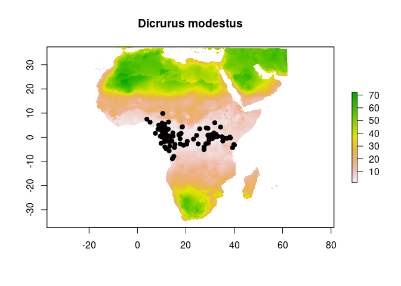
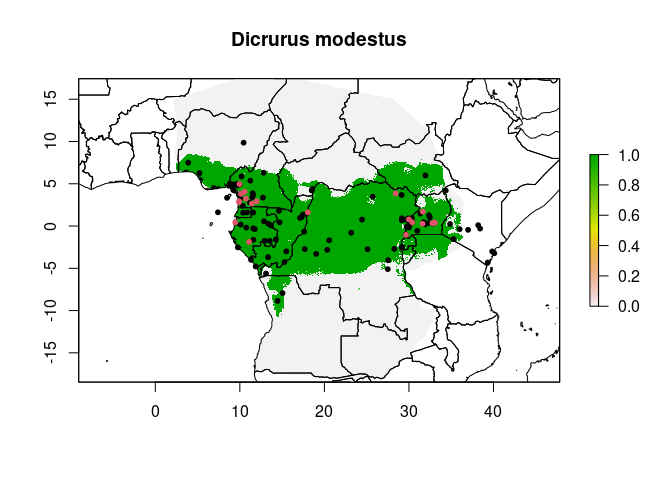
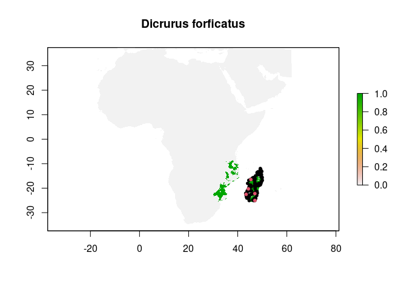
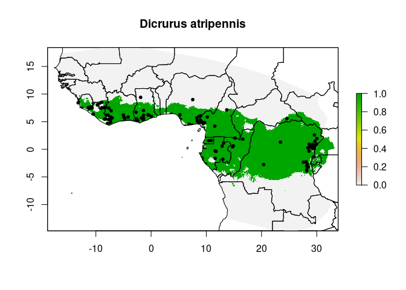
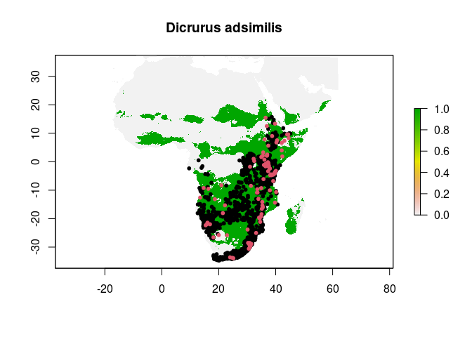
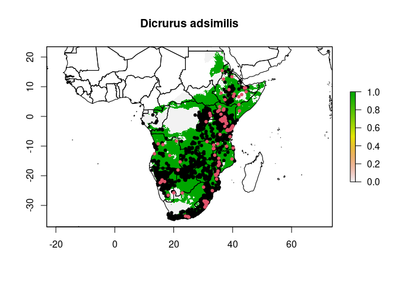

MVE Modeling
================

Running MVE modeling separately here, given how massive the
environmental files are.

``` r
library(data.table)
library(fitdistrplus)
```

    ## Loading required package: MASS

    ## Loading required package: survival

``` r
library(MASS)
library(raster)
```

    ## Loading required package: sp

    ## 
    ## Attaching package: 'raster'

    ## The following object is masked from 'package:MASS':
    ## 
    ##     select

``` r
library(rgdal)
```

    ## Please note that rgdal will be retired by the end of 2023,
    ## plan transition to sf/stars/terra functions using GDAL and PROJ
    ## at your earliest convenience.
    ## 
    ## rgdal: version: 1.5-29, (SVN revision 1165M)
    ## Geospatial Data Abstraction Library extensions to R successfully loaded
    ## Loaded GDAL runtime: GDAL 3.0.4, released 2020/01/28
    ## Path to GDAL shared files: /usr/share/gdal
    ## GDAL binary built with GEOS: TRUE 
    ## Loaded PROJ runtime: Rel. 6.3.1, February 10th, 2020, [PJ_VERSION: 631]
    ## Path to PROJ shared files: /usr/share/proj
    ## Linking to sp version:1.4-6
    ## To mute warnings of possible GDAL/OSR exportToProj4() degradation,
    ## use options("rgdal_show_exportToProj4_warnings"="none") before loading sp or rgdal.

``` r
library(sf)
```

    ## Linking to GEOS 3.8.0, GDAL 3.0.4, PROJ 6.3.1; sf_use_s2() is TRUE

``` r
#library(sprawl) #Error in R studio
library(tidyverse)
```

    ## ── Attaching packages ─────────────────────────────────────── tidyverse 1.3.1 ──

    ## ✓ ggplot2 3.3.5     ✓ purrr   0.3.4
    ## ✓ tibble  3.1.6     ✓ dplyr   1.0.8
    ## ✓ tidyr   1.2.0     ✓ stringr 1.4.0
    ## ✓ readr   2.1.2     ✓ forcats 0.5.1

    ## ── Conflicts ────────────────────────────────────────── tidyverse_conflicts() ──
    ## x dplyr::between()   masks data.table::between()
    ## x tidyr::extract()   masks raster::extract()
    ## x dplyr::filter()    masks stats::filter()
    ## x dplyr::first()     masks data.table::first()
    ## x dplyr::lag()       masks stats::lag()
    ## x dplyr::last()      masks data.table::last()
    ## x dplyr::select()    masks raster::select(), MASS::select()
    ## x purrr::transpose() masks data.table::transpose()

# Ecological Niche Modeling

Using the pipeline of MVEs, we can create niche models for all of these
species.

Define functions.

``` r
data=read_csv(paste0(filepath,"env_extracts.csv"))
```

    ## Rows: 2420 Columns: 18
    ## ── Column specification ────────────────────────────────────────────────────────
    ## Delimiter: ","
    ## chr  (3): Species, Subspecies, Source
    ## dbl (15): Long, Lat, current_30arcsec_annualPET, current_30arcsec_aridityInd...
    ## 
    ## ℹ Use `spec()` to retrieve the full column specification for this data.
    ## ℹ Specify the column types or set `show_col_types = FALSE` to quiet this message.

``` r
#MAJA function
maja=function(p,m,s)((p-m)%*%s%*%t(p-m))^0.5

#Quantile function
##Double check function? divide by 1 is 1...
##changed to 4, for quantiles
NDquantil=function(nD,level){
  return(round(nD*level))
}
```

``` r
# altered to fit this dataset; needs more tinkering to be function.

ssp.plot=function(ssp,ssp.text,data,model_files){
  y=stack(model_files)
  
  vals=data%>%
    filter(Species==ssp)%>%
    # remove character fields
    dplyr::select(-Species,-Subspecies,
                  # remove coordinates
                  -Long,-Lat,-Source)%>%
                  # remove extraneous ENVIREM
                  # not needed for now
                  #-`current_2-5arcmin_tri`,
                  #-`current_2-5arcmin_continentality`,
                  #-`current_2-5arcmin_growingDegDays0`,
                  #-`current_2-5arcmin_growingDegDays5`,
                  #-`current_2-5arcmin_maxTempColdest`,
                  #-`current_2-5arcmin_monthCountByTemp10`,
                  #-`current_2-5arcmin_PETColdestQuarter`,
                  #-`current_2-5arcmin_PETseasonality`,
                  #-`current_2-5arcmin_thermicityIndex`)%>%
    # remove NA values
    na.omit()%>%
    # get unique - presence only for each site
    # uniform representation across presences
    unique()
  
  coords.vals=data%>%
    filter(Species==ssp)%>%
    # remove character fields
    dplyr::select(Long,Lat)%>%
    # get unique - presence only for each site
    # uniform representation across presences
    unique()
  
  n1=NDquantil(nrow(vals),0.9)

  mve1=cov.mve(vals,quantile.use=n1)

  nc=ncell(y)
  
  # these specific files are divisible by 4
  
  # break up into four sections
  
  mu1=matrix(mve1$center,nrow=1)
  s1=mve1$cov
  invs1=solve(s1)

  # break up over giant raster
  
  mu2=as.matrix(mu1)
  invs2=as.matrix(invs1)
  
  dT1=matrix(0,ncol=1,nrow=nc)
  
  # divisible by 200
  
  for(ii in 1:200){
    if((ii%%10)==0){print((ii/200)*100)}
    index=(((nc*(ii-1)/200)+1):((nc*ii)/200))
    # extract cell values
    valsT=raster::extract(x=y,
                          y=index)
    # transform to matrix
    valsT1=as.matrix(valsT)
    # free up space
    rm(valsT)
    # calculate values
    for(j in 1:length(index)){
      dT1[index[j],1]=maja(valsT1[j,],
                            mu2,
                            invs2)
    }
  }
  
  # classify prediction raster
  q=raster(nrow=nrow(y),ncol=ncol(y),
         ext=extent(y),resolution=res(y),vals=dT1)
  setwd(paste0(filepath,'MVEs/raw_mve/'))
  #sp1=strsplit(sp,'[.]')[[1]][1]
  sp1=ssp.text
  writeRaster(q,filename=sp1,format='ascii',overwrite=T)
  #plot(q)
  
  ext=raster::extract(x=q,y=coords.vals)
  ext2=na.omit(ext)

  # Remove the furthest 5% to reflect locality confidence
  # threshold based on these values
  
  ext2=ext2[order(ext2)]
  # cutoff=round(0.95*length(ext2))
  # ext3=ext2[1:cutoff]
  
  # for this, containing only up to 95% of points
  
  # changing from other code
  # most points near center, drop off
  # Need equation that accounts for increasing distances
  # also need to exclude any super far outliers if lots of data
  
  # gamma distribution, shape = 1
  # 
  
  eq.x=fitdist(ext2,dist="gamma",method="mle")
  
  # get rate; shape should be set to 1
  rate.x=eq.x$estimate["rate"]
  shape.x=eq.x$estimate["shape"]
  
  thresh.val.75=qgamma(0.75,shape=shape.x,rate=rate.x)
  thresh.val.85=qgamma(0.85,shape=shape.x,rate=rate.x)
  thresh.val.90=qgamma(0.90,shape=shape.x,rate=rate.x)
  thresh.val.95=qgamma(0.95,shape=shape.x,rate=rate.x)
  thresh.val.99=qgamma(0.99,shape=shape.x,rate=rate.x)
  
  # theshold matrices
  m=c(NA,NA,NA,
      0,thresh.val.75,1,
      thresh.val.75,thresh.val.85,2,
      thresh.val.85,thresh.val.90,3,
      thresh.val.90,thresh.val.95,4,
      thresh.val.95,thresh.val.99,5,
      thresh.val.99,Inf,6)
  # binary, 90% matrix
  m_bin=c(NA,NA,NA,
          0,thresh.val.90,1,
          thresh.val.90,Inf,0)
 
  # free memory
  rm(valsT1)
  rm(dT1)
  rm(vals)
  
  #Current threshold
  ##Used only here; heirarchical for other parts
  
  m=matrix(m,ncol=3,byrow=T)
  m_bin=matrix(m_bin,ncol=3,byrow=T)
  rc=reclassify(q,m_bin)
  
  # ensure there is data for writing later
  #y2=y[which(ext>ND),]

  #Create color threshold for past models
  #color change for every standard deviation
  
  #New threshold on current conditions, then hierarchical
  #Created here, executed further down
  
  species=ssp.text

  #if(nrow(y2)!=0){
    #setwd(paste0(filepath,"MVEs/threshold_mve/"))
    #write.csv(y2,file=paste0(species,'_out.csv'),quote=F,row.names=F)
  #}
  pathway=paste0(filepath,"MVEs/threshold_mve/",
                 species,".asc",sep="")
  writeRaster(rc,pathway,overwrite=T)
  
  xlim=c(min(coords.vals$Long)-4,
         max(coords.vals$Long)+4)
  ylim=c(min(coords.vals$Lat)-4,
         max(coords.vals$Lat)+4)
  
  #plot(rc,xlim=xlim,ylim=ylim)
  #points(coords.vals,pch=19,col="black")

  #threshold classify tier
  thresh=reclassify(q,m)
  pathway=paste0(filepath,"MVEs/threshold_mve/",
                 species,"-tier.asc",sep="")
  writeRaster(thresh,pathway,overwrite=T)
  #plot(thresh,
  #     xlim=xlim,ylim=ylim)
  rm(thresh)
  
  #Create color bands of how far it is from center
  
  ### For now, no past climate models.
}
```

#### Examples of being run

``` r
ssp.plot(ssp = "Dicrurus occidentalis",
         ssp.text = "Dicrurus_occidentalis",
         data=data,
         model_files = env_layers)

ssp.plot(ssp = "Dicrurus sharpei",
         ssp.text = "Dicrurus_sharpei",
         data=data,
         model_files = env_layers)

ssp.plot(ssp = "Dicrurus ludwigii",
         ssp.text = "Dicrurus_ludwigii",
         data=data,
         model_files = env_layers)

ssp.plot(ssp = "Dicrurus atripennis",
         ssp.text = "Dicrurus_atripennis",
         data=data,
         model_files = env_layers)

ssp.plot(ssp = "Dicrurus adsimilis",
         ssp.text = "Dicrurus_adsimilis",
         data=data,
         model_files = env_layers)

ssp.plot(ssp = "Dicrurus divaricatus",
         ssp.text = "Dicrurus_divaricatus",
         data=data,
         model_files = env_layers)

# already ran atactus

ssp.plot(ssp = "Dicrurus modestus",
         ssp.text = "Dicrurus_modestus",
         data=data,
         model_files = env_layers)

ssp.plot(ssp = "Dicrurus forficatus",
         ssp.text = "Dicrurus_forficatus",
         data=data,
         model_files = env_layers)
```

## View Models

``` r
species="Dicrurus atactus"
land=readOGR(paste0(gis,'ne_10m_admin_0_countries/ne_10m_admin_0_countries.shp'))
```

    ## OGR data source with driver: ESRI Shapefile 
    ## Source: "/home/j141c380/Dropbox/GIS/ne_10m_admin_0_countries/ne_10m_admin_0_countries.shp", layer: "ne_10m_admin_0_countries"
    ## with 255 features
    ## It has 94 fields
    ## Integer64 fields read as strings:  POP_EST NE_ID

``` r
species_viewer=function(species,land){
  data.subset=data%>%
    filter(Species==species)%>%
    dplyr::select(Long,Lat)
  
  paste0(gsub(" ","_",species),".asc")
  
  shp_file=readOGR(paste0(filepath,"ssp_shp/",
                  gsub(" ","_",species),'.gpkg'))
  
  #raw first
  x=raster(paste0(filepath,"MVEs/raw_mve/",
                  paste0(gsub(" ","_",species),".asc")))
  
  plot(x,main=species)
  points(data.subset,pch=19)
  
  #threshold second
  x=raster(paste0(filepath,"MVEs/threshold_mve/",
                  paste0(gsub(" ","_",species),".asc")))
  
  plot(x,main=species)
  points(data.subset,pch=20)
  
  # limit to dispersal area
  x2=mask(x,shp_file)
  x=crop(x2,shp_file)
  
  xlim=c(extent(x)[1:2])*1.2
  ylim=c(extent(x)[3:4])*1.2
  
  plot(x,main=species)
  plot(land,add=T)
  points(data.subset,pch=20)
}
```

``` r
species_viewer(species="Dicrurus sharpei",
               land=land)
```

    ## OGR data source with driver: GPKG 
    ## Source: "/home/j141c380/Dropbox/Manuscripts/Dicrurus/ssp_shp/Dicrurus_sharpei.gpkg", layer: "Dicrurus_sharpei"
    ## with 1 features
    ## It has 1 fields
    ## Integer64 fields read as strings:  id

<!-- --><!-- --><!-- -->

``` r
species_viewer(species="Dicrurus occidentalis",
               land=land)
```

    ## OGR data source with driver: GPKG 
    ## Source: "/home/j141c380/Dropbox/Manuscripts/Dicrurus/ssp_shp/Dicrurus_occidentalis.gpkg", layer: "Dicrurus_occidentalis"
    ## with 1 features
    ## It has 1 fields
    ## Integer64 fields read as strings:  id

<!-- --><!-- --><!-- -->

``` r
species_viewer(species="Dicrurus modestus",
               land=land)
```

    ## OGR data source with driver: GPKG 
    ## Source: "/home/j141c380/Dropbox/Manuscripts/Dicrurus/ssp_shp/Dicrurus_modestus.gpkg", layer: "Dicrurus_modestus"
    ## with 1 features
    ## It has 1 fields
    ## Integer64 fields read as strings:  id

<!-- --><!-- --><!-- -->

``` r
species_viewer(species="Dicrurus ludwigii",
               land=land)
```

    ## OGR data source with driver: GPKG 
    ## Source: "/home/j141c380/Dropbox/Manuscripts/Dicrurus/ssp_shp/Dicrurus_ludwigii.gpkg", layer: "Dicrurus_ludwigii"
    ## with 1 features
    ## It has 1 fields
    ## Integer64 fields read as strings:  id

<!-- --><!-- --><!-- -->

``` r
species_viewer(species="Dicrurus forficatus",
               land=land)
```

    ## OGR data source with driver: GPKG 
    ## Source: "/home/j141c380/Dropbox/Manuscripts/Dicrurus/ssp_shp/Dicrurus_forficatus.gpkg", layer: "Dicrurus_forficatus"
    ## with 1 features
    ## It has 1 fields
    ## Integer64 fields read as strings:  id

<!-- --><!-- --><!-- -->

``` r
species_viewer(species="Dicrurus divaricatus",
               land=land)
```

    ## OGR data source with driver: GPKG 
    ## Source: "/home/j141c380/Dropbox/Manuscripts/Dicrurus/ssp_shp/Dicrurus_divaricatus.gpkg", layer: "Dicrurus_divaricatus"
    ## with 1 features
    ## It has 1 fields
    ## Integer64 fields read as strings:  id

<!-- --><!-- --><!-- -->

``` r
species_viewer(species="Dicrurus atripennis",
               land=land)
```

    ## OGR data source with driver: GPKG 
    ## Source: "/home/j141c380/Dropbox/Manuscripts/Dicrurus/ssp_shp/Dicrurus_atripennis.gpkg", layer: "Dicrurus_atripennis"
    ## with 1 features
    ## It has 1 fields
    ## Integer64 fields read as strings:  id

<!-- --><!-- --><!-- -->

``` r
species_viewer(species="Dicrurus atactus",
               land=land)
```

    ## OGR data source with driver: GPKG 
    ## Source: "/home/j141c380/Dropbox/Manuscripts/Dicrurus/ssp_shp/Dicrurus_atactus.gpkg", layer: "Dicrurus_atactus"
    ## with 1 features
    ## It has 1 fields
    ## Integer64 fields read as strings:  id

<!-- --><!-- --><!-- -->

``` r
species_viewer(species="Dicrurus adsimilis",
               land=land)
```

    ## OGR data source with driver: GPKG 
    ## Source: "/home/j141c380/Dropbox/Manuscripts/Dicrurus/ssp_shp/Dicrurus_adsimilis.gpkg", layer: "Dicrurus_adsimilis"
    ## with 1 features
    ## It has 1 fields
    ## Integer64 fields read as strings:  id

<!-- --><!-- --><!-- -->
